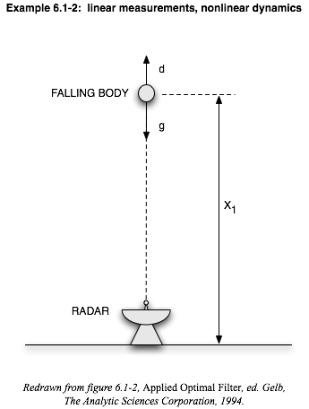

(This is the type of result this script produces - explained fully on my webpage linked below.)
----------------------------------------------------------------
gravdragdemo.m, Oct 2006
Andy Ganse, Applied Physics Laboratory, University of Washington
aganse@apl.washington.edu
----------------------------------------------------------------

A classic textbook on predictive filters is Applied Optimal Estimation, editted by Gelb (1974).  In section 6.1 of that book are two simple radar tracking examples (6.1-2 and 6.1-3) which demonstrate several nonlinear filters:

 

I've programmed up those examples into a Matlab script called gravdragdemo.m and added a few other filters to compare and contrast them in both linear and nonlinear cases (in the measurements as well as the dynamics), forming a really broad tutorial on these different types of filters.  Filters in the script include:  Kalman Filter, Kalman Smoother, Linearized Kalman Filter, Extended Kalman Filter, 2nd order Extended Kalman Filter.

These examples use radar ranging to estimate the elevation, downward velocity, and drag coefficient for a falling body as functions of time.  The problem and this script's results are discussed fully on my webpage: http://staff.washington.edu/aganse/gelbexample
The plots on that webpage were produced by this script but are included here (along with the two diagram figures).

In the Matlab script we can choose whether to make the measurements a linear or nonlinear function of the states by setting r1 and r2 to be nonzero or zero. We can also specify whether to make the dynamics linear or nonlinear by setting the forces on the falling body (drag d and gravitational acceleration g) to nonzero or zero. Granted, for the linear case it's a little strange because the "falling" body no longer even has gravity acting on it, but the idea was to have an example which kept at its initial velocity to make it linear - so sue me!
